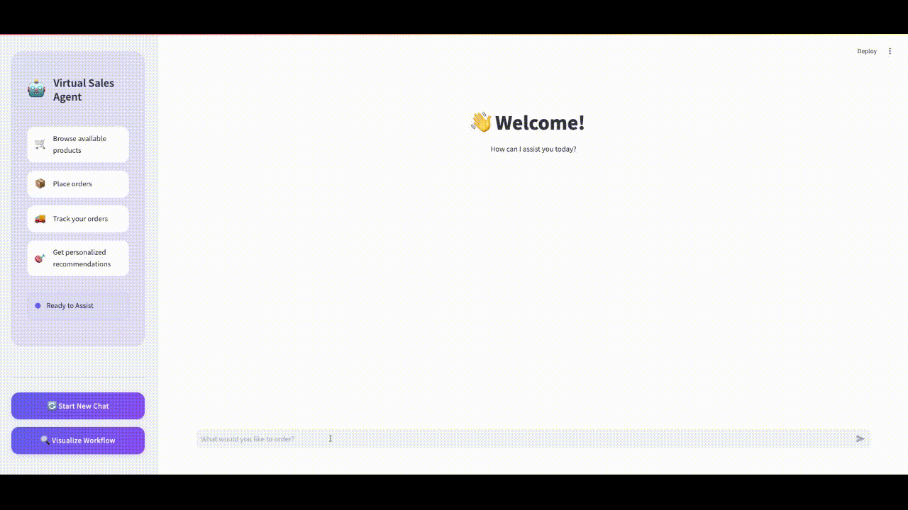

# Virtual Sales Agent powered by LangGraph, Streamlit & Gemini Flash

This project implements a **Virtual Sales Agent** that simulates customer interactions, providing information and support through a Streamlit interface. Using the power of **LangChain**, **LangGraph**, and a SQLite database, this agent can answer product questions, create orders, check order statuses, and offer personalized recommendations. These tools are divided into safe and sensitive categories. For sensitive tools, such as creating orders, a human-in-the-loop mechanism is implemented, requiring approval or denial before proceeding.

👉 Check out a quick demo of the Virtual Sales Agent in action in the [Interface Preview](#interface-preview) section!


---

## 📖 Table of Contents
1. [Key Features](#key-features)
2. [Built With](#built-with)
3. [Use Cases](#use-cases)
4. [Project Structure](#project-structure)
5. [Interface Preview](#interface-preview)
6. [Get Started](#get-started)
7. [Contributing](#contributing)
8. [Related Resources](#related-resources)
9. [Future Plans](#future-plans)
10. [License](#license)

---

## ✨ Key Features {#key-features}

This virtual sales agent can assist customers with:

1. **Product Inquiries:**
   - Answer questions about product availability, pricing, and stock levels.
   - **Example Questions:**
     - "What products do you have in stock?"
     - "How much does product X cost?"
     - "Is product Y available?"

2. **Order Placement:**
   - Allow customers to create new orders, referencing data from the database.
   - **Example Request:** "I would like to order 2 units of product Z."

3. **Order Tracking:**
   - Provide up-to-date status information for existing orders.
   - **Example Question:** "What is the status of order #54321?"

4. **Personalized Recommendations:**
   - Suggest relevant products based on a customer's past purchase history.
   - **Example Recommendation:** "Based on your previous order, you might also like product A."

---

## 🎯 Use Cases {#use-cases}

This Virtual Sales Agent is ideal for:
- **E-commerce websites** to streamline customer service and increase sales.
- **Customer support teams** looking to automate routine tasks while maintaining user control.
- **Sales teams** to recommend personalized products based on purchase history.

---

## 🛠️ Built With {#built-with}

- **LangChain:** Provides the framework for developing AI-powered conversational applications.
- **LangGraph:** Enables the creation of sophisticated, stateful agent workflows.
- **SQLite:** A lightweight database for managing product data and orders.
- **Streamlit:** Facilitates the development of interactive web applications for the agent interface.
- **Gemini Flash 2.0:** A fast and efficient large language model from Google for natural language understanding.

---

## 📂 Project Structure {#project-structure}

Here's a breakdown of the project's directory structure:

```
.
├── assets/
│   ├── graph.png             # Agent workflow diagram
│   ├── human_in_the_loop.png # Human-in-the-loop interface screenshot
│   ├── streamlit.png         # Main interface screenshot
│   └── style.css             # Streamlit custom styling
├── database/
│   ├── db/
│   │   ├── products.json         # Bot product data (initial)
│   │   └── schemas.sql           # SQL schema definitions
│   ├── db_manager.py             # Handles database interactions
│   └── config.py                 # Database connection configuration
├── virtual_sales_agent/
│   ├── graph.py                  # LangGraph agent state machine and logic
│   ├── tools.py                  # Custom tools used by the agent
│   └── utils_functions.py        # Utility functions for the agent
├── env-example                   # Environment variables template
├── main.py                       # Main Streamlit app
├── README.md                     # This file!
├── requirements.txt              # Project dependencies
└── setup_database.py             # Script to initialize the database
```

---

## 🖼️ Interface Preview {#interface-preview}

1. **🎥 Demo GIF**
   Here's a quick demonstration of the Virtual Sales Agent in action:
   - **Main Interface:** A clean and intuitive chatbot interface that interacts with customers to answer queries and perform tasks.
   - **Human-in-the-Loop Approval System:** A mechanism where sensitive actions, like order creation, require user approval. Users can review the action details and provide feedback for continuous improvement.

   

2. **LangGraph Workflow**

    
    
---

## 🚀 Get Started {#get-started}

Follow these steps to set up and run the Virtual Sales Agent:

### Prerequisites

- Ensure you have **Python 3.12 or later** installed on your machine.
- We recommend using a virtual environment for managing dependencies.

### Installation Steps

1. **Clone the Repository:**
   ```bash
   git clone https://github.com/lucasboscatti/sales-ai-agent-langgraph.git
   cd virtual-sales-agent
   ```

2. **Create a Virtual Environment:**
   ```bash
   python3 -m venv venv
   source venv/bin/activate    # Linux/Mac
   venv\Scripts\activate       # Windows
   ```

3. **Install Dependencies:**
   ```bash
   pip install -r requirements.txt
   ```

4. **Environment Configuration:**
   - Rename the `.env-example` file to `.env`.
   - Set up your API keys:
     - **Google Gemini Flash:** Requires a `GOOGLE_API_KEY`, along with your `GOOGLE_APPLICATION_CREDENTIALS` (path to your credentials file), `GCP_PROJECT_ID` and `REGION`. Obtain these from your Google Cloud Platform (GCP) account at [Google AI Studio](https://aistudio.google.com/).
     - **LangSmith:** Create a [LangSmith](https://smith.langchain.com/) account and get your `LANGCHAIN_API_KEY`. This is for monitoring and debugging agent interactions.
   - Load environment variables:
     ```bash
     source .env
     ```

5. **Initialize the Database:**
   ```bash
   python3 setup_database.py
   ```

6. **Launch the Streamlit App:**
   ```bash
   streamlit run main.py
   ```

   This will open the application in your web browser, and you can start interacting with the Virtual Sales Agent.

---

## 🤝 Contributing {#contributing}

We welcome contributions to improve this project! Here’s how you can help:
1. Fork the repository and create a feature branch.
2. Follow Python best practices (e.g., PEP 8).
3. Submit a pull request with a clear description of your changes.
4. For bug reports or feature requests, please open an issue.

---

## 📚 Related Resources {#related-resources}

- [LangChain Documentation](https://python.langchain.com/docs/introduction/)
- [LangGraph Documentation](https://langchain-ai.github.io/langgraph/tutorials/introduction/)
- [Streamlit Documentation](https://docs.streamlit.io)
- [Google Gemini Flash](https://aistudio.google.com/)

---

## 🚀 Future Plans {#future-plans}

- Fuzzy logic for product names matching

---

## 📝 License {#license}

This project is licensed under the MIT License. See the [LICENSE](LICENSE) file for more details.

---